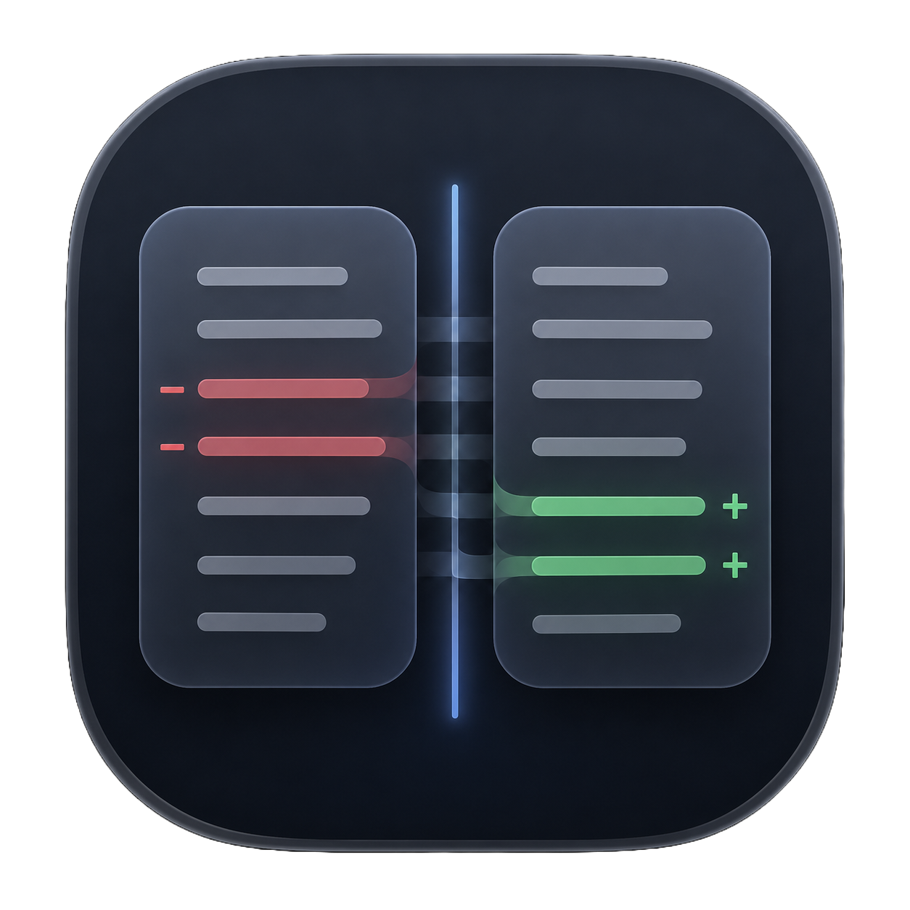
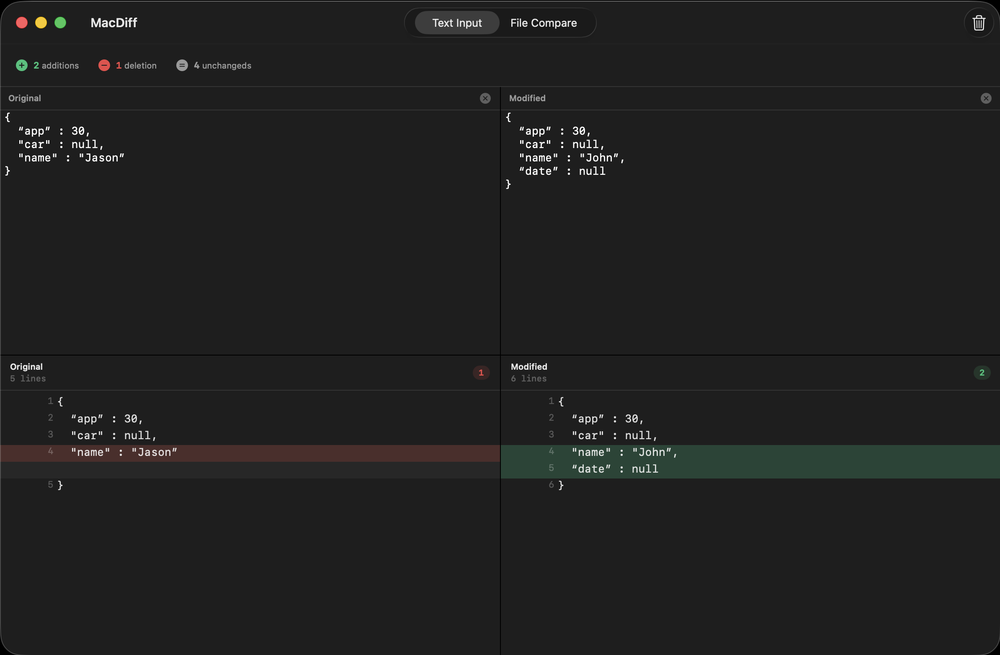

# MacDiff




A native macOS diff viewer built with SwiftUI and Swift Package Manager. Compare text snippets or files side-by-side, with automatic JSON normalisation, synchronised scrolling, and a live change summary.



---

## Features

- **Side-by-side diff** — Original and Modified panes displayed in parallel with colour-coded additions (green) and deletions (red)
- **Two input modes**
  - **Text Input** — paste or type content directly into both panes
  - **File Compare** — drag-and-drop or pick files from a standard open panel
- **Automatic JSON normalisation** — when JSON content is detected it is automatically pretty-printed and key-sorted before diffing, making structural changes easy to spot; a `{}  JSON` badge is shown in the pane header when this mode is active
- **Synchronised scrolling** — both panes scroll together so corresponding lines always stay aligned
- **Live summary banner** — real-time animated counters for additions, deletions, and unchanged lines; displays a "Files are identical" badge when there are no differences
- **Myers diff algorithm** — uses Swift's native `CollectionDifference` (Myers algorithm) for accurate, minimal diffs
- **Empty-row alignment** — placeholder rows are inserted to keep paired changes aligned across panes

## Requirements

| | |
|---|---|
| macOS | 14 Sonoma or later |
| Xcode / Swift | Swift 5.9+ |
| Build tool | Swift Package Manager (no Xcode required) |

## Building

### Quick build (release)

```bash
./build.sh
```

This compiles a release binary and assembles `MacDiff.app` in the project root. Run it with:

```bash
open MacDiff.app
```

### Debug build

```bash
swift build
```

The binary is placed at `.build/debug/MacDiff`.

### Manual bundle assembly

The `build.sh` script performs the following steps automatically:

1. `swift build -c release`
2. Creates `MacDiff.app/Contents/{MacOS,Resources}/`
3. Copies the compiled binary, `Info.plist`, and `AppIcon.icns`
4. Sets the executable bit

## Project Structure

```
MacDiff/
├── Package.swift               # SPM manifest
├── build.sh                    # Build + bundle script
├── MacDiff/
│   ├── MacDiffApp.swift        # @main entry point
│   ├── Info.plist              # Bundle metadata & icon declaration
│   ├── MacDiff.entitlements    # Sandbox entitlements
│   ├── Resources/
│   │   └── AppIcon.icns        # Application icon
│   ├── Models/
│   │   ├── DiffModels.swift    # DiffLine, DiffResult, AppMode enums
│   │   ├── DiffEngine.swift    # Myers diff computation
│   │   └── JSONNormalizer.swift# JSON detection, pretty-print & key-sort
│   ├── ViewModels/
│   │   └── DiffViewModel.swift # @Observable state, scroll sync, file loading
│   └── Views/
│       ├── ContentView.swift       # Root layout, toolbar, mode picker
│       ├── SummaryBannerView.swift # Animated additions/deletions/unchanged counters
│       ├── DiffPaneView.swift      # Single pane header + scroll view
│       ├── SyncedScrollTextView.swift # NSScrollView bridge for locked scrolling
│       ├── TextInputModeView.swift # Editable text-input mode
│       ├── FileModeView.swift      # File-compare mode with drop zones
│       └── DropZoneView.swift      # Drag-and-drop / open-panel file picker
```

## Architecture

MacDiff follows a straightforward MVVM pattern:

- **`DiffEngine`** is a pure, stateless enum that takes two strings and returns a `DiffResult` using Swift's `CollectionDifference` API.
- **`JSONNormalizer`** is a pure utility that detects JSON, pretty-prints it, and sorts keys — all before the diff runs, so the output reflects meaningful semantic differences rather than formatting noise.
- **`DiffViewModel`** (`@Observable`) owns all mutable state. Text changes are debounced by 150 ms before triggering a recompute. File loads bypass the debounce by calling `scheduleRecompute()` directly.
- **`ScrollSyncController`** is a lightweight `@Observable` class shared between both panes. Sub-pixel jitter (< 0.5 pt) is filtered out to prevent feedback loops.
- **Views** are stateless renderers that read from the view model and dispatch actions back to it.

## License

MIT
